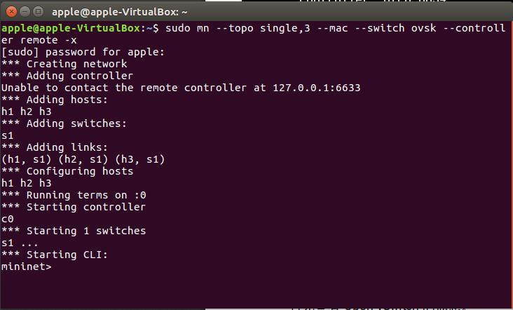

# 測試環境:ubuntu 16.04 LTS
###簡單安裝教學(https://github.com/playerlove1/SDN-test)

### 1.撰寫監控程式碼(simple_monitor.py)
##如圖

##接續


### 1.建置Mininet
### 交換器1台(single)、host3台的拓璞(3)、使用Open vSwitch(ovsk)、指定外部的 OpenFlow Controller(remote)、啟動 xterm(-x)
```console
sudo mn --topo single,3 --mac --switch ovsk --controller remote -x
```
##如圖


### 2.查看Switch(s1)狀態
### 查看界面卡連接狀態
```console
ovs-vsctl show
```
##如圖

### 查看介面卡與port連接狀態
```console
ovs-vsctl show
```
##如圖


### 3.設定OpenFlow的版本為1.3
```console
ovs-vsctl set Bridge s1 protocols=OpenFlow13
```
##如圖


### 4.檢查空白的Flow Table
### ovs-ofctl用來指定OpenFlow版本。預設值是OpenFlow10
```console
ovs-ofctl -O OpenFlow13 dump-flows s1
```
##如圖


### 5.執行監控程式
### --verbose列出詳細執行訊息、./當前目錄下的檔案
```console
ryu-manager --verbose ./simple_monitor.py
```
##如圖


### 6.h1 ping h2(10.0.0.2)
### -c1代表ping一個packet
```console
ping -c1 10.0.0.2
```
如圖


### 6.查看controller變化
##如圖


### 7.比較前後差別
##如圖
